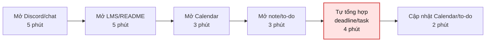
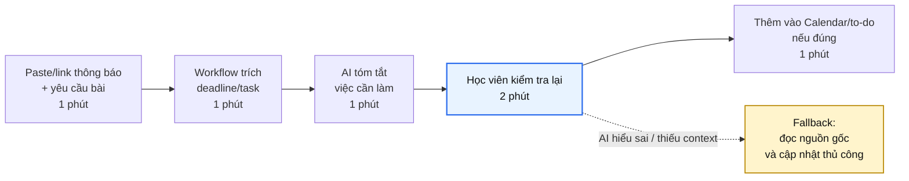
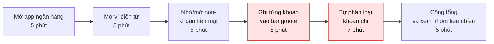
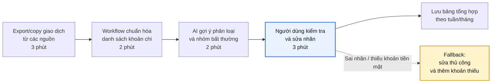
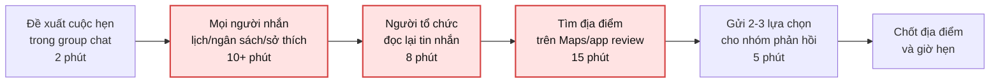
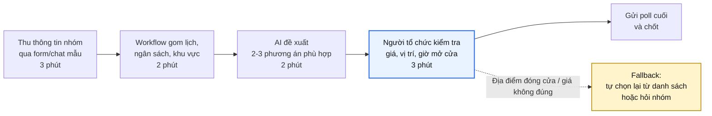

## Scan rộng

| # | Chủ đề | Lăng kính | Problem quan sát được | Ai đang đau? | Dấu hiệu thật |
|---|---|---|---|---|---|
| 1 | Học tập | Lặp lại / Tốn thời gian | Theo dõi deadline rải rác nhiều nơi như LMS, Discord, Calendar, note cá nhân | Học viên có nhiều bài/lab cùng lúc | Hầu như tuần nào cũng phải mở 3-4 app để chắc bài nào sắp đến hạn |
| 2 | Học tập | Tốn thời gian | Tìm lại câu trả lời cũ trong Discord hoặc chat lớp khi cần làm bài | Học viên, giảng viên | Mỗi lần tìm mất khoảng 10-20 phút vì phải nhớ keyword và đọc nhiều đoạn chat |
| 3 | Học tập | Pain từ người khác | Không biết bài nộp còn thiếu field nào trước deadline | Học viên nộp bài theo rubric/checklist | Trước khi nộp thường phải so lại README, worksheet và file làm bài trong 15-25 phút |
| 4 | Tài chính cá nhân | Lặp lại / Tốn thời gian | Theo dõi chi tiêu rải rác giữa app ngân hàng, ví điện tử, tiền mặt và ghi chú cá nhân | Sinh viên/người trẻ muốn kiểm soát tiền hằng tháng | Cuối tuần/tháng phải cộng lại thủ công 20-30 phút, dễ quên khoản tiền mặt |
| 5 | Tài chính cá nhân | AI có thể tốt hơn | Phân loại khoản chi không nhất quán, ví dụ ăn uống, học tập, di chuyển, mua sắm | Người tự quản lý ngân sách cá nhân | Cùng một loại chi tiêu nhưng lúc ghi là "ăn", lúc ghi là "cafe", lúc nằm trong ví điện tử |
| 6 | Đi lại / ăn uống | Tốn thời gian / Pain từ người khác | Lên kế hoạch đi ăn/đi chơi nhóm mất thời gian vì phải gom sở thích, ngân sách, vị trí và lịch rảnh | Nhóm bạn hoặc nhóm học chung | Mỗi lần chọn quán có thể kéo dài 20-40 phút trong chat, nhiều người không phản hồi đủ |
| 7 | Làm việc nhóm | Lặp lại / Pain từ người khác | Chia việc nhóm và theo dõi ai đang làm phần nào trong bài nhóm | Thành viên nhóm làm assignment/lab chung | Hay phải hỏi lại trong chat; dễ trùng việc hoặc chờ nhau nếu không có owner rõ |
| 8 | Quản lý cá nhân | Lặp lại | Quản lý task cá nhân giữa Calendar, to-do app và tin nhắn nhóm | Người vừa học vừa làm việc nhóm | Mỗi ngày mất 5-10 phút rà lại; task dễ bị rơi nếu chỉ nằm trong chat |
| 9 | Tìm kiếm thông tin | Tốn thời gian / Lặp lại | Tìm file, link hoặc tài liệu cũ nằm rải rác trong Drive, Discord, browser bookmark | Học viên/người làm dự án cá nhân | Mỗi lần tìm mất 5-15 phút; keyword không nhớ chính xác thì phải hỏi lại người khác |
| 10 | Nội dung số | Tốn thời gian / AI có thể tốt hơn | Tóm tắt video, bài giảng hoặc bài viết dài để lấy ý chính | Học viên hoặc người tự học online | Video 30-60 phút khó tua đúng đoạn; mất nhiều thời gian nếu chỉ cần vài ý chính |

## Chọn top 3

| Rank | Problem | Chủ đề | Vì sao chọn | Điều còn chưa chắc |
|---|---|---|---|---|
| 1 | Theo dõi deadline rải rác nhiều app | Học tập | Workflow rõ, xảy ra thường xuyên, impact dễ đo bằng thời gian và số deadline bị bỏ sót | Cần xác nhận số app và tần suất trễ/nhầm deadline thật trong vài tuần gần đây |
| 2 | Theo dõi chi tiêu rải rác giữa app ngân hàng, ví điện tử, tiền mặt và ghi chú | Tài chính cá nhân | Có pain lặp lại, dữ liệu đến từ nhiều nguồn, metric dễ đo bằng thời gian tổng hợp cuối tuần/tháng | Cần biết mức độ sẵn sàng nhập dữ liệu thủ công hay export từ app |
| 3 | Lên kế hoạch đi ăn/đi chơi nhóm từ sở thích, ngân sách, vị trí và lịch rảnh | Đi lại / ăn uống | Nhiều người cùng tham gia, bottleneck nằm ở gom ý kiến và chốt phương án, có thể so sánh rule/workflow/AI | Cần validate xem nhóm thật sự muốn tối ưu hay chỉ chấp nhận chat thủ công |

---

# Problem Card #1 — Theo dõi deadline rải rác nhiều app

**Problem 1 câu:**  
Học viên mất thời gian và dễ bỏ sót deadline vì thông tin bài nộp nằm rải rác trong LMS, Discord, Calendar, note cá nhân và file hướng dẫn.

**Actor:**  
Học viên đang tham gia nhiều buổi lab/assignment trong cùng tuần.

**Thời điểm / bối cảnh:**  
Cuối ngày hoặc trước mỗi buổi học, khi cần kiểm tra bài nào sắp đến hạn và cần chuẩn bị gì.

**Current workflow:**

```text
1. Mở Discord/chat lớp để xem thông báo mới
2. Mở LMS hoặc README để kiểm tra yêu cầu bài
3. Mở Calendar để xem deadline đã được lưu chưa
4. Mở note/to-do app để so lại task cá nhân
5. Tự tổng hợp deadline và việc cần làm
6. Cập nhật lại Calendar/to-do nếu thiếu
```

**Bottleneck:**  
Bước 5 — tự tổng hợp deadline và việc cần làm từ nhiều nguồn, mất khoảng 15-20 phút/lần và dễ sót thông tin.

**Impact:**  
Nếu kiểm tra 3 lần/tuần, tổng thời gian khoảng 45-60 phút/tuần. Khi sót deadline, bài nộp dễ bị làm gấp hoặc thiếu field.

**Success metric:**  
Giảm thời gian rà deadline từ 15-20 phút/lần xuống dưới 5 phút/lần, và không bỏ sót deadline/bài cần nộp trong tuần.

**Non-AI alternative:**  
Dùng một checklist cố định hoặc Calendar rule: mọi deadline phải được nhập ngay khi có thông báo. Cách này đơn giản nhưng vẫn phụ thuộc vào việc tự nhớ cập nhật.

**AI hypothesis:**  
AI hỗ trợ đọc/tóm tắt thông báo và file hướng dẫn được cung cấp, sau đó đề xuất danh sách deadline/task. Học viên vẫn kiểm tra lại trước khi thêm vào Calendar.

**Quick gut:**  
Workflow.

## Draft current workflow



## Draft future workflow



---

# Problem Card #2 — Theo dõi chi tiêu rải rác nhiều nguồn

**Problem 1 câu:**  
Người tự quản lý tài chính cá nhân mất thời gian tổng hợp chi tiêu vì giao dịch nằm rải rác trong app ngân hàng, ví điện tử, tiền mặt và ghi chú cá nhân.

**Actor:**  
Sinh viên hoặc người trẻ muốn biết mình đã tiêu bao nhiêu theo tuần/tháng.

**Thời điểm / bối cảnh:**  
Cuối tuần hoặc cuối tháng, khi cần xem lại chi tiêu để biết có vượt ngân sách không.

**Current workflow:**

```text
1. Mở app ngân hàng để xem lịch sử giao dịch
2. Mở ví điện tử để xem các khoản thanh toán nhỏ
3. Nhớ lại hoặc mở note về các khoản tiền mặt
4. Copy/ghi từng khoản vào bảng tính hoặc note
5. Tự phân loại khoản chi
6. Cộng tổng và xem nhóm nào tiêu nhiều
```

**Bottleneck:**  
Bước 4-5 — nhập lại và phân loại khoản chi thủ công, mất khoảng 20-30 phút/lần tổng hợp.

**Impact:**  
Nếu không tổng hợp đều, người dùng không biết khoản nào đang vượt ngân sách. Các khoản nhỏ như cafe, ăn vặt, gửi xe dễ bị bỏ sót.

**Success metric:**  
Giảm thời gian tổng hợp chi tiêu cuối tuần/tháng từ 20-30 phút xuống dưới 10 phút, và giảm số khoản "không phân loại" xuống dưới 10%.

**Non-AI alternative:**  
Dùng một app quản lý chi tiêu và nhập ngay sau mỗi giao dịch. Cách này đơn giản nhưng dễ thất bại nếu người dùng quên nhập hoặc dùng nhiều nguồn thanh toán.

**AI hypothesis:**  
AI hỗ trợ đọc danh sách giao dịch được người dùng cung cấp, gợi ý phân loại chi tiêu và phát hiện khoản bất thường. Người dùng vẫn kiểm tra lại trước khi lưu báo cáo.

**Quick gut:**  
Workflow.

## Draft current workflow



## Draft future workflow



---

# Problem Card #3 — Lên kế hoạch đi ăn/đi chơi nhóm

**Problem 1 câu:**  
Nhóm bạn mất nhiều thời gian chốt địa điểm đi ăn/đi chơi vì phải gom sở thích, ngân sách, vị trí và lịch rảnh của từng người trong chat.

**Actor:**  
Một nhóm 3-6 người muốn hẹn đi ăn, học nhóm hoặc đi chơi sau giờ học/làm.

**Thời điểm / bối cảnh:**  
Trước buổi hẹn 1-2 ngày, khi nhóm cần chọn thời gian, địa điểm và phương án di chuyển.

**Current workflow:**

```text
1. Một người đề xuất đi ăn/đi chơi trong group chat
2. Mỗi người nhắn lịch rảnh, ngân sách, món muốn ăn hoặc khu vực tiện đi
3. Người đứng ra tổ chức đọc lại nhiều tin nhắn
4. Tìm quán/địa điểm phù hợp trên Google Maps hoặc app review
5. Gửi 2-3 lựa chọn để nhóm phản hồi
6. Chốt địa điểm, giờ hẹn và nhắc lại cho mọi người
```

**Bottleneck:**  
Bước 2-4 — gom ý kiến không đồng bộ và tự lọc địa điểm phù hợp, mất khoảng 20-40 phút trong chat.

**Impact:**  
Cuộc hẹn bị kéo dài phần chốt kế hoạch, có người không phản hồi, người tổ chức phải hỏi lại nhiều lần hoặc chọn đại.

**Success metric:**  
Giảm thời gian chốt phương án từ 20-40 phút xuống dưới 10 phút, và có ít nhất 2 lựa chọn phù hợp với phần lớn nhóm.

**Non-AI alternative:**  
Dùng poll cố định: chọn giờ, khu vực, ngân sách, loại món. Cách này đủ cho nhóm đơn giản nhưng vẫn cần người tự tìm địa điểm.

**AI hypothesis:**  
AI hỗ trợ tổng hợp sở thích/lịch rảnh/ngân sách từ form hoặc chat, sau đó gợi ý vài phương án. Người tổ chức vẫn kiểm tra địa điểm thật, giá và giờ mở cửa trước khi chốt.

**Quick gut:**  
Workflow.

## Draft current workflow



## Draft future workflow



---
