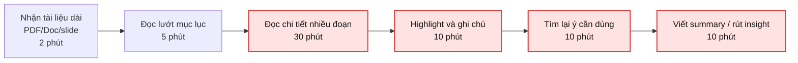
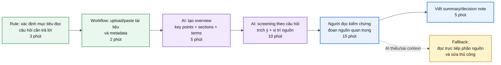

<!-- # Phase 3 — Group Convergence: từ 9-12 candidates về 1

## Mục tiêu

Nhóm 3-4 người sẽ có khoảng 9-12 candidate problems. Không vote ngay. Đi qua 4 bước hội tụ:

```text
Trình bày top 3
→ gom trùng / cluster
→ shortlist
→ chấm nhanh + đồng thuận chọn 1 candidate problem
```

Nhóm lúc này **chỉ chọn candidate problem**, chưa viết Problem Statement hoàn chỉnh. -->

## Bước 3.1

| # | Người đưa ra | Candidate problem | Người gặp vấn đề | Điểm nghẽn | Cảm nhận nhanh |
|---|---|---|---|---|---|
| 1 | Khiêm | Theo dõi deadline rải rác nhiều app | Học viên có nhiều bài/lab cùng lúc | Tự tổng hợp deadline và việc cần làm từ LMS, Discord, Calendar, note cá nhân | Workflow rõ, xảy ra thường xuyên, impact dễ đo |
| 2 | Khiêm | Theo dõi chi tiêu rải rác giữa app ngân hàng, ví điện tử, tiền mặt và ghi chú | Sinh viên/người trẻ muốn kiểm soát tiền hằng tháng | Nhập lại và phân loại khoản chi thủ công từ nhiều nguồn | Pain lặp lại, metric dễ đo bằng thời gian tổng hợp |
| 3 | Khiêm | Lên kế hoạch đi ăn/đi chơi nhóm từ sở thích, ngân sách, vị trí và lịch rảnh | Nhóm bạn hoặc nhóm học chung | Gom ý kiến không đồng bộ và tự lọc địa điểm phù hợp | Có nhiều người tham gia, bottleneck rõ |
| 4 | Chí | Email & Message Management | Accounnt Manager, PM | Phải đọc, phân loại và trả lời hàng trăm tin nhắn và email khác nhau | Khá phổ biến |
| 5 | Chí | Manual Data Entry from Invoices & Doc | Accountant | Nhập thủ công hàng trăm hóa đơn mất nhiều thời gian | Pain phổ biến với doanh nghiệp vừa và nhỏ |
| 6 | Chí | Documents Reading & Information Screening | Học viên, PM | Mất nhiều thời gian để đọc tài liệu | Dễ gây mất thông tin |
| 7 | Kiên | Chat nhầm channel → thông tin rối loạn trong Discord | Sinh viên trong nhóm học | Thông tin cập nhật nằm rải rác nhiều channel, khó theo dõi tiến độ; phải hỏi lại nhiều lần hoặc scroll chat để tìm update cũ | Pain xảy ra thường xuyên trong nhóm học/lab, workflow rõ, ảnh hưởng coordination |
| 8 | Kiên | Deadline / requirement bị trôi trong Discord | Sinh viên trong nhóm học  | Thông tin quan trọng bị chìm trong chat hoặc tài liệu dài; mất thời gian tìm requirement đúng phiên bản, dẫn đến hỏi lặp lại | Pain lặp lại nhiều lần, boundary rõ (Discord/LMS), có thể đo bằng số câu hỏi lặp hoặc thời gian tìm thông tin |
| 9 | Kiên | Discord search kém, khó tìm tài liệu hoặc quyết định cũ | Học viên muốn kiểm tra bài trước khi nộp | Phải dò lại chat thủ công để tìm rubric/checklist/quyết định cũ; search theo keyword không hiệu quả hoặc thiếu context | Có workflow cụ thể trước khi nộp bài, dễ validate qua thời gian tìm tài liệu hoặc số lần hỏi lại |
| 10 | Mạnh | Mỗi tuần tổng hợp tiến độ dự án từ nhiều nguồn (Jira, Slack, Teams, Discord) vào report | Team lead, project manager | Mất 60-90 phút/tuần, hay viết narrative lâu, thường trễ deadline | Workflow rõ nhất |
| 11 | Mạnh | Đọc và tóm tắt tài liệu dài hoặc nghiên cứu phức tạp với nhiều thuật ngữ chuyên ngành | Student, researcher | Mất 45-60 phút/tài liệu, khó hiểu overview nhanh | Demo nhanh |
| 12 | Mạnh | Mỗi lần bắt đầu project/khoá mới phải viết lại setup instruction từ đầu hoặc tìm lại cũ | Developer, student, new team member | Tốn nhiều thời gian setup, hay bỏ sót bước hoặc version mismatch | Lặp lại rõ ràng |

## Bước 3.2 — Gom trùng / cluster

| Cluster | Candidates included | Pattern chung | Ghi chú |
|---|---|---|---|
| A. Theo dõi deadline / requirement / cập nhật trong Discord | Theo dõi deadline rải rác nhiều app; Chat nhầm channel → thông tin rối loạn trong Discord; Deadline / requirement bị trôi trong Discord | Thông tin quan trọng nằm rải rác ở LMS, Discord, Calendar, note hoặc nhiều channel nên người học phải tự gom lại | Nhóm này trùng pain học tập rõ nhất, có thể đo bằng thời gian tìm deadline và số lần hỏi lại |
| B. Tìm kiếm tài liệu / quyết định / thông tin cũ | Discord search kém, khó tìm tài liệu hoặc quyết định cũ; Documents Reading & Information Screening; Đọc và tóm tắt tài liệu dài hoặc nghiên cứu phức tạp | Người dùng cần tìm đúng ý trong tài liệu/chat dài nhưng search theo keyword hoặc đọc thủ công mất thời gian | Cần giới hạn nguồn dữ liệu để không bị quá rộng |
| C. Báo cáo / tổng hợp tiến độ từ nhiều nguồn | Mỗi tuần tổng hợp tiến độ dự án từ nhiều nguồn vào report | Gom thông tin từ Jira, Slack, Teams, Discord rồi viết lại thành report có narrative | Workflow rất rõ, impact đo được bằng 60-90 phút/tuần |
| D. Nhập liệu / chuẩn hóa dữ liệu thủ công | Theo dõi chi tiêu rải rác giữa app ngân hàng, ví điện tử, tiền mặt và ghi chú; Manual Data Entry from Invoices & Doc | Dữ liệu nằm ở nhiều nguồn hoặc nhiều định dạng, người dùng phải nhập lại và phân loại thủ công | Có pain lặp lại, nhưng domain tài chính/kế toán cần kiểm lỗi cẩn thận |
| E. Planning / coordination nhóm | Lên kế hoạch đi ăn/đi chơi nhóm từ sở thích, ngân sách, vị trí và lịch rảnh; Email & Message Management | Nhiều người/nhiều luồng thông tin cần được gom, phân loại và chốt hành động tiếp theo | Workflow có nhiều actor, dễ phát sinh thiếu phản hồi hoặc thông tin bị trôi |
| F. Setup / hướng dẫn lặp lại | Mỗi lần bắt đầu project/khoá mới phải viết lại setup instruction từ đầu hoặc tìm lại cũ | Kiến thức setup nằm rải rác, người mới dễ thiếu bước hoặc dùng sai version | Pain lặp lại rõ nhưng cần chọn một project/khoá cụ thể để làm trong lab |

## Bước 3.3 — Shortlist

| Candidate | Vì sao vào shortlist | Rủi ro / điều chưa rõ |
|---|---|---|
| Documents Reading & Information Screening | Nhiều actor gặp pain khi phải đọc tài liệu dài để tìm ý chính hoặc thông tin cần thiết; workflow có thể vẽ rõ từ nhận tài liệu → đọc → lọc ý → ghi lại thông tin | Cần giới hạn loại tài liệu và tiêu chí "thông tin quan trọng" để không bị quá rộng |
| Mỗi tuần tổng hợp tiến độ dự án từ nhiều nguồn vào report | Workflow rõ nhất, lặp lại hằng tuần, bottleneck nằm ở bước gom thông tin từ Jira, Slack, Teams, Discord và viết narrative; impact đo được bằng 60-90 phút/tuần | Cần xác định nguồn dữ liệu mẫu trong lab và format report đầu ra |
| Lên kế hoạch đi ăn/đi chơi nhóm từ sở thích, ngân sách, vị trí và lịch rảnh | Có nhiều người tham gia, bottleneck là gom ý kiến không đồng bộ và chốt phương án; có thể so sánh rule/form/workflow/AI | Cần validate xem nhóm thật sự muốn tối ưu hay chỉ chấp nhận chat thủ công |

## Bước 3.4 — Score để đồng thuận

| Candidate | Actor rõ | Workflow rõ | Pain có evidence | Impact đo được | Làm trong lab | So sánh R/W/A được | Nhóm hiểu domain | Tổng |
|---|---:|---:|---:|---:|---:|---:|---:|---:|
| Documents Reading & Information Screening | 5 | 5 | 4 | 5 | 5 | 5 | 5 | 34 |
| Mỗi tuần tổng hợp tiến độ dự án từ nhiều nguồn vào report | 5 | 5 | 5 | 5 | 4 | 5 | 4 | 33 |
| Lên kế hoạch đi ăn/đi chơi nhóm từ sở thích, ngân sách, vị trí và lịch rảnh | 5 | 4 | 4 | 4 | 4 | 5 | 5 | 31 |

Candidate nhóm chọn:

```text
Documents Reading & Information Screening
```

Vì sao chọn:

```text
Nhóm chọn Documents Reading & Information Screening vì actor rõ là học viên, PM hoặc người cần đọc nhanh tài liệu dài để lấy thông tin quan trọng.
Workflow hiện tại dễ quan sát: nhận tài liệu → đọc toàn bộ → highlight/ghi chú → tìm thông tin cần thiết → tóm tắt hoặc ra quyết định.
Bottleneck nằm ở bước đọc và lọc thông tin, mất khoảng 45-60 phút/tài liệu và dễ bỏ sót ý quan trọng.
Trong lab, nhóm có thể dùng một tài liệu mẫu, đo thời gian đọc/tóm tắt trước-sau, và so sánh được Rule / Workflow / Agent rõ.
```

Vì sao không chọn các candidate còn lại:

```text
Mỗi tuần tổng hợp tiến độ dự án từ nhiều nguồn vào report có workflow rất rõ nhưng cần nhiều nguồn dữ liệu mẫu như Jira, Slack, Teams, Discord nên khó chuẩn bị đầy đủ trong lab.
Lên kế hoạch đi ăn/đi chơi nhóm có nhiều actor và bottleneck rõ, nhưng impact thường nhỏ hơn và phụ thuộc nhiều vào phản hồi của từng người trong nhóm.
```

---

# Phase 4 — Quick Validation + Research giải pháp

## Bước 4.1 — Quick validation

| Nguồn | Số người / số mẫu | Tín hiệu xác nhận | Tín hiệu phản bác | Nhóm sửa problem thế nào |
|---|---:|---|---|---|
| Interview | 3 người | 2/3 người nói thường mất 45-60 phút để đọc tài liệu dài hoặc tài liệu có nhiều thuật ngữ; bước đau nhất là tìm đúng ý cần dùng | 1 người nói nếu tài liệu ngắn dưới 5 trang thì đọc trực tiếp nhanh hơn dùng tool | Giới hạn bài toán vào tài liệu dài hoặc phức tạp, không áp dụng cho tài liệu ngắn |
| Survey / poll | 7 phản hồi | 5/7 người từng phải đọc lại nhiều đoạn vì không chắc ý chính; 4/7 người muốn có summary kèm vị trí nguồn để kiểm chứng | Một số người không tin summary nếu không có citation/source gốc | Thêm yêu cầu output phải có trích dẫn/vị trí nguồn và người đọc phải review lại |
| Log / review / ticket | Quan sát từ workflow học tập/làm việc | Tài liệu lab, research paper, policy, PRD thường dài; người đọc cần lọc mục tiêu, requirement, risk hoặc action item | Nếu tài liệu đã có executive summary tốt thì pain giảm | Problem tập trung vào screening và finding, không chỉ tóm tắt chung chung |

## Bước 4.2 — Research giải pháp đã có

| Nguồn / tool / case | Link | Họ giải quyết phần nào? | Điểm mạnh | Khoảng trống / rủi ro | Bài học cho nhóm |
|---|---|---|---|---|---|
| Microsoft Copilot summarize files | [Microsoft Support](https://support.microsoft.com/en-gb/office/summarize-your-files-with-copilot-10dcbe50-467d-4a61-9d5e-c98c77fd33a4) | Tóm tắt file Word, PDF, PowerPoint, Excel trong OneDrive/SharePoint | Tích hợp vào workflow tài liệu sẵn có, hỗ trợ tóm tắt nhiều định dạng | Phụ thuộc license và hệ sinh thái Microsoft; người dùng vẫn cần kiểm chứng nội dung | Bài toán nên giữ bước human review và không coi summary là final answer |
| Adobe Acrobat AI Assistant | [Adobe Acrobat](https://www.adobe.com/acrobat/generative-ai-pdf.html) | Tóm tắt PDF, hỏi đáp tài liệu, tìm insight trong document | Mạnh với PDF, có hướng tập trung vào attribution/source trong tài liệu | Có thể không phù hợp với mọi format hoặc tài liệu nhạy cảm | Output nên kèm nguồn/đoạn liên quan để giảm rủi ro hallucination |
| Google NotebookLM | [NotebookLM](https://notebooklm.google/) | Cho phép upload nguồn, tóm tắt, hỏi đáp và tạo ghi chú dựa trên nguồn người dùng cung cấp | Tập trung vào source-grounded research, hữu ích khi có nhiều tài liệu | Nếu nguồn đưa vào thiếu hoặc sai thì kết quả vẫn lệch; cần quản lý privacy | Workflow nên bắt đầu bằng chọn nguồn đúng và câu hỏi screening rõ |
| Copilot trong Teams chat | [Microsoft Support](https://support.microsoft.com/en-us/office/summarize-shared-files-in-teams-chats-29e56340-4467-413f-af64-4233204b4a61) | Tóm tắt file được chia sẻ trong Teams chat mà không phải mở đọc toàn bộ | Giảm thời gian catch-up với file được gửi trong nhóm | Có thể làm người dùng đọc lướt quá nhanh và bỏ qua chi tiết quan trọng | Summary nên dùng để định hướng đọc, không thay thế đọc kỹ phần quan trọng |

---

# Phase 5 — Workflow + Problem Statement

## Bước 5.1 — Current workflow bản nhóm



| Bước | Actor | Input | Output | Thời gian/tần suất | Ghi chú |
|---|---|---|---|---|---|
| 1 | Học viên / PM | Tài liệu dài như PDF, PRD, research paper, policy, slide | Tài liệu cần đọc | 2 phút / mỗi tài liệu | Nguồn có thể khác format |
| 2 | Học viên / PM | Tiêu đề, mục lục, heading | Ước lượng phần cần đọc | 5 phút / mỗi tài liệu | Nếu tài liệu không có cấu trúc thì khó scan |
| 3 | Học viên / PM | Toàn bộ nội dung tài liệu | Hiểu sơ bộ nội dung chính | 30 phút / mỗi tài liệu | Bước tốn thời gian nhất |
| 4 | Học viên / PM | Đoạn quan trọng | Highlight, note, câu hỏi | 10 phút / mỗi tài liệu | Dễ highlight quá nhiều hoặc thiếu ý |
| 5 | Học viên / PM | Note và tài liệu gốc | Các ý cần dùng cho bài/lab/quyết định | 10 phút / mỗi tài liệu | Phải tìm lại vị trí nguồn |
| 6 | Học viên / PM | Ý đã lọc | Summary, insight, action item hoặc câu trả lời | 10 phút / mỗi tài liệu | Có rủi ro hiểu sai nếu tài liệu phức tạp |

Bottleneck chính:

```text
Bottleneck chính nằm ở bước 3-6: người đọc phải tự đọc nhiều trang, lọc ý quan trọng, tìm lại nguồn và viết summary/insight. Tổng thời gian khoảng 45-60 phút cho một tài liệu dài hoặc phức tạp.
```

## Bước 5.2 — Future workflow bản nhóm



Before/after impact:

| Metric | Trước | Sau kỳ vọng | Ghi chú |
|---|---:|---:|---|
| Số bước | 6 | 6 | Số bước không giảm nhiều, nhưng bước đọc thủ công ngắn hơn |
| Tổng thời gian | 45-60 phút/tài liệu | 25-40 phút/tài liệu | Giảm khoảng 30-45% |
| Số bước thủ công | 6 | 3 | Người đọc vẫn đặt mục tiêu, kiểm chứng nguồn, viết/chốt note |
| Bottleneck chính | Đọc toàn bộ và tự lọc ý | Kiểm chứng đoạn nguồn AI gợi ý | Bottleneck chuyển từ đọc toàn bộ sang đọc có định hướng |
| Risk mới | Bỏ sót ý do đọc mệt hoặc tài liệu dài | AI tóm tắt sai, bỏ qua nuance, chọn sai đoạn nguồn | Cần citation/source và review bắt buộc |

## Bước 5.3 — Problem Statement v0

| Field | Nội dung |
|---|---|
| **Actor** | Học viên, PM hoặc người phải đọc tài liệu dài/phức tạp để tìm thông tin cần dùng |
| **Workflow** | Nhận tài liệu, đọc lướt, đọc chi tiết, highlight, tìm lại ý quan trọng, viết summary/insight hoặc decision note |
| **Bottleneck** | Đọc và lọc thông tin thủ công mất nhiều thời gian, dễ bỏ sót ý quan trọng hoặc khó tìm lại nguồn khi cần kiểm chứng |
| **Impact** | Mất khoảng 45-60 phút/tài liệu; summary có thể thiếu ý, hiểu sai thuật ngữ hoặc không có nguồn để kiểm lại |
| **Success Metric** | Giảm thời gian đọc/lọc xuống 25-40 phút/tài liệu; mỗi ý quan trọng có nguồn tham chiếu; giảm số lần phải đọc lại toàn bộ tài liệu |
| **Boundary** | Chỉ xử lý 1-3 tài liệu văn bản/PDF/slide trong một lần; không dùng cho tài liệu pháp lý/y tế/tài chính high-stakes nếu không có chuyên gia review; AI không thay người đọc quyết định cuối |

---

# Phase 6 — Rule / Workflow / Agent + Decision

## Bước 6.0 — Ma trận độ phù hợp với AI để suy nghĩ nhanh

Bài toán của nhóm nằm ở ô nào?

```text
Độ mơ hồ cao + độ phức tạp trung bình.
```

Vì sao?

```text
Tóm tắt và lọc thông tin có nhiều cách trả lời vẫn chấp nhận được, nên độ mơ hồ cao. Độ phức tạp ở mức trung bình vì workflow có nhiều bước nhưng input/output khá rõ: tài liệu, mục tiêu đọc, key points, source/citation và summary cuối. AI không cần tự lập kế hoạch dài hạn hay tự gọi nhiều công cụ phức tạp.
```

## Bước 6.1 — So sánh Rule / Workflow / Agent

| Mức | Phương án cho bài toán nhóm | Khi nào đủ | Rủi ro | Chọn? |
|---|---|---|---|---|
| **Rule** | Dùng checklist đọc tài liệu: mục tiêu đọc, 5 ý chính, thuật ngữ mới, câu hỏi còn lại, đoạn nguồn | Đủ với tài liệu ngắn hoặc tài liệu đã có cấu trúc rõ | Không giảm nhiều thời gian đọc tài liệu dài; vẫn phải tự lọc và viết summary | Không |
| **Workflow** | Người dùng đặt mục tiêu đọc, AI tạo overview và screening theo câu hỏi, output kèm nguồn, người dùng kiểm chứng và viết note cuối | Đủ khi tài liệu và câu hỏi screening rõ, cần tăng tốc đọc/lọc nhưng vẫn có human review | AI có thể bỏ sót nuance, hiểu sai thuật ngữ hoặc trích nhầm đoạn | Có |
| **Agent** | Agent tự đọc nhiều nguồn, tự đặt câu hỏi, tự research thêm và tự tạo decision note | Chỉ phù hợp nếu cần đi qua nhiều nguồn mở, tự tìm tài liệu mới và lập kế hoạch nghiên cứu | Scope rộng, khó kiểm soát nguồn, dễ hallucination hoặc dùng nguồn không phù hợp | Không |

Mức chọn:

```text
Workflow
```

Vì sao chọn:

```text
Workflow phù hợp nhất vì các bước đã rõ: xác định mục tiêu đọc, đưa tài liệu vào, AI tạo overview, AI lọc thông tin theo câu hỏi, người đọc kiểm chứng nguồn và chốt summary. AI hỗ trợ phần đọc/lọc tốn thời gian nhưng không thay quyết định cuối của con người.
```

Vì sao không chọn mức đơn giản hơn:

```text
Rule/checklist đọc tài liệu giúp người đọc có cấu trúc hơn nhưng không giải quyết đủ pain khi tài liệu dài 20-50 trang hoặc nhiều thuật ngữ. Người đọc vẫn phải tự đọc gần như toàn bộ và tự tìm lại đoạn nguồn.
```

## Bước 6.2 — Problem Statement v1

| Field | Nội dung |
|---|---|
| **Actor** | Học viên, PM hoặc researcher phải đọc tài liệu dài/phức tạp để lấy thông tin chính xác cho bài làm, review hoặc quyết định |
| **Workflow** | Actor nhận tài liệu, xác định mục tiêu đọc, đọc lướt, đọc chi tiết, highlight, tìm thông tin liên quan, kiểm chứng nguồn và viết summary/insight |
| **Bottleneck** | Việc đọc toàn bộ và screening thủ công mất nhiều thời gian; người đọc dễ bỏ sót ý quan trọng, khó tìm lại nguồn và khó phân biệt ý chính với chi tiết phụ |
| **Impact** | Mất 45-60 phút cho một tài liệu dài; dễ phải đọc lại nhiều lần; summary có thể thiếu evidence hoặc không truy ngược được đoạn nguồn |
| **Success Metric** | Giảm thời gian đọc/lọc xuống 25-40 phút/tài liệu; 100% ý chính trong summary có source/citation; người đọc chỉ cần đọc kỹ các đoạn quan trọng thay vì đọc lại toàn bộ |
| **Boundary** | Chỉ hỗ trợ tài liệu học tập, research, PRD, policy nội bộ hoặc project document; không tự kết luận cho tài liệu high-stakes; không dùng khi tài liệu chứa thông tin nhạy cảm chưa được phép upload |
| **AI intervention point** | AI tạo overview, liệt kê key points/terms, lọc thông tin theo câu hỏi của người đọc và đưa ra đoạn nguồn liên quan |
| **Mức chọn** | Workflow |
| **Rủi ro & người thật kiểm tra** | Rủi ro AI hiểu sai ngữ cảnh, bỏ sót nuance hoặc trích sai đoạn. Người đọc phải mở lại source/citation quan trọng trước khi dùng summary |

## Bước 6.3 — Final decision

| Câu hỏi | Yes / Not Yet / No | Ghi chú |
|---|---|---|
| Actor và workflow đã rõ chưa? | Yes | Actor là học viên/PM/researcher; workflow đọc và screening tài liệu rõ |
| Baseline và success metric đã đo được chưa? | Yes | Baseline 45-60 phút/tài liệu, mục tiêu 25-40 phút/tài liệu |
| Có data/input đủ dùng chưa? | Yes | Có thể dùng 1-3 tài liệu mẫu dạng PDF/Doc/slide trong lab |
| Nếu AI sai, hậu quả có chấp nhận được không? | Yes | Chấp nhận được nếu bắt buộc kiểm chứng source trước khi dùng |
| Có người review/owner vận hành không? | Yes | Người đọc là owner, tự kiểm chứng đoạn nguồn |
| Có cách non-AI đơn giản hơn không? | Yes | Checklist đọc tài liệu và template ghi chú, nhưng giảm thời gian ít hơn |

Decision:

```text
Go
```

Lý do:

```text
Nên Go với phạm vi nhỏ vì problem rõ, có dữ liệu mẫu dễ chuẩn bị, impact đo được bằng thời gian đọc/lọc và rủi ro có thể kiểm soát bằng source/citation + human review. AI chỉ hỗ trợ screening và draft summary, không thay người đọc quyết định cuối.
```

Nếu Go, pilot nhỏ nhất là:

```text
Chạy thử với 1 tài liệu dài 20-30 trang hoặc 1 PRD/research paper. Đo thời gian người đọc tự đọc và ghi summary, sau đó chạy workflow AI để tạo overview + key points + source/citation. So sánh thời gian, số ý đúng, số ý bị thiếu và mức độ dễ kiểm chứng nguồn.
```

Nếu Not Yet, cần validate gì trước:

```text
Cần thêm 2-3 tài liệu mẫu khác nhau, xác định tiêu chí "ý quan trọng", và kiểm thử xem AI có trích đúng nguồn không.
```

Nếu No-Go, nên làm gì thay AI:

```text
Dùng checklist đọc tài liệu, template note cố định, highlight theo màu và yêu cầu mỗi summary đều ghi số trang/đoạn nguồn.
```
